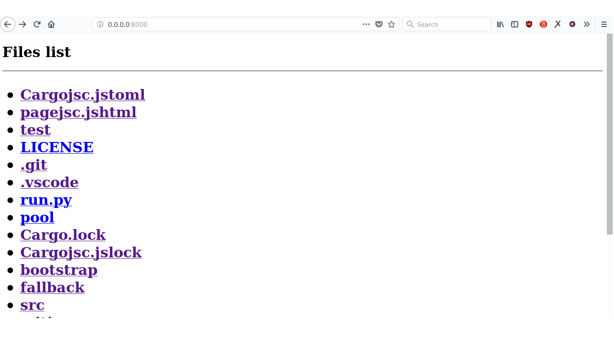

# Toy-server
Http server made with rust.

## What does it do?

Same as python http-server but a toy compared.

Made with no extra crates, why does it matter you ask? less compile time ;)

Share current directory through http or specify names of files and directories to share.

## what does it look like



## Usage

toy-server creates each time you use it a `dir.html` page, so if you care about not beign invaded by its clones everywhere you should use the python wrapper which will clean after usage.

**share current dir**

`python run.py`

**share specific files/folders**

`python run.py foo bar/`

Then open `0.0.0.0:8000`.

## Informations**

**1-** if you share specific files/folders the paths have to be relative. 

example: `current_dir = /$HOME/toy `

```
  .__foo
  |__bar/foo
```

*Ok:* `python run.py foo bar/foo`

*Error:* `python run.py /home/$HOME/toy/foo /home/$HOME/toy/bar/foo`

**2-** this program dosen't consider security at all so use it only on trusted LAN.
